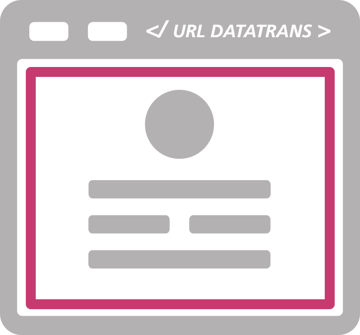
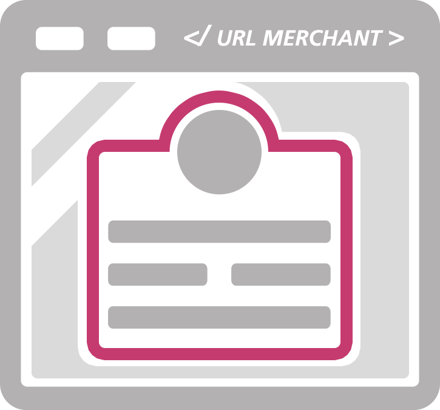
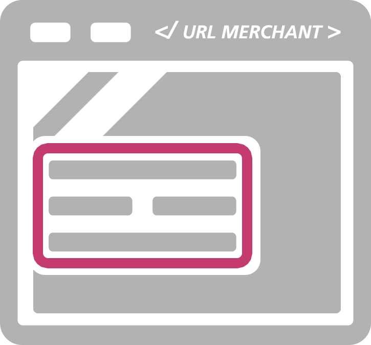

# Inbound: Web Interface (Payment Page)

Our Payment Pages are different web interfaces (APIs) that can be used to tokenise credit card numbers. For in-
stance, it can be used in the reservation process to guarantee a booking.  

Through our APIs, the guest’s computer communicates directly with our servers to exchange its credit card num-
ber for a credit card token and forwards only the token to your servers. **Hence, channel is PCI compliant**.

## Responsive Payment Page & Inline Mode
Redirect Mode| Lightbox Mode        | Inline Mode 
:------------:|:--------------------:|:-----------:
 |  |       
Redirect of consumer to payment page managed by Datatrans. | Payment pages are placedon shop as overlay (iFrame). | Payment page managed by Datatrans is incorporated with iFrame.    

A comprehensive documentation of our Payment pages can be found on our [Showcase](https://datatrans.ch/showcase/authorisation/redirect-mode)

---

<!--

# Inbound: Push Operation (XML/SOAP API)

# Inbound: Pull Operation (XML/SOAP API)

# Outbound: Web Interface (NoShow)

-->